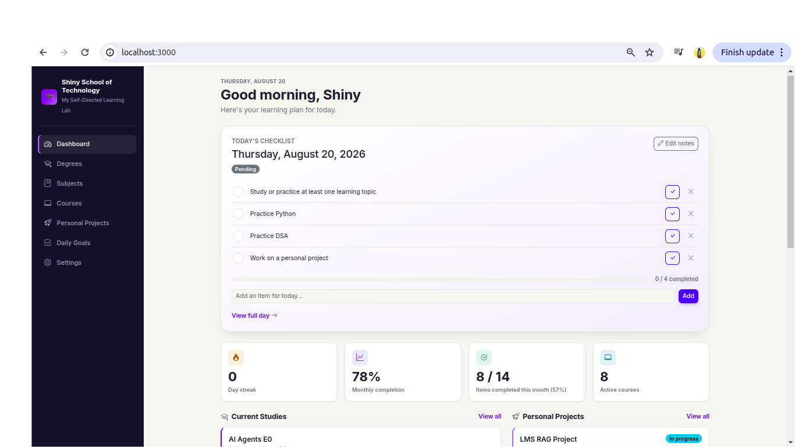
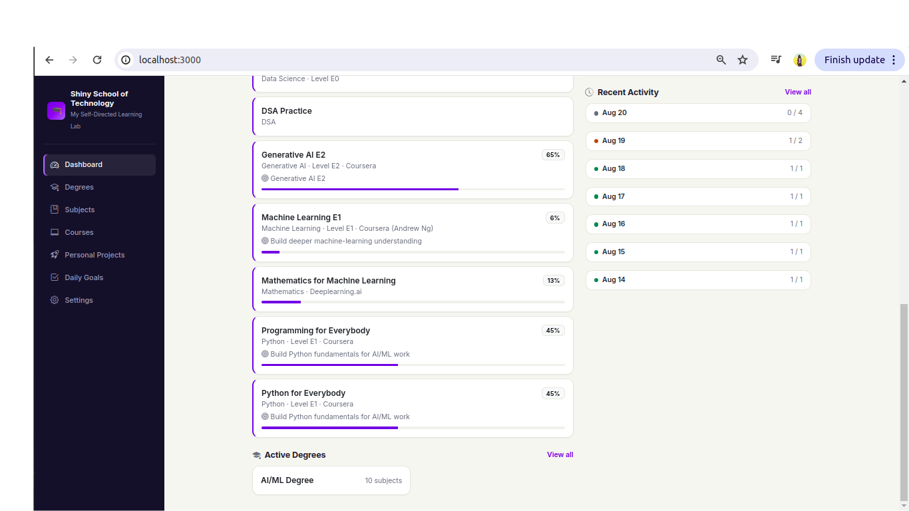
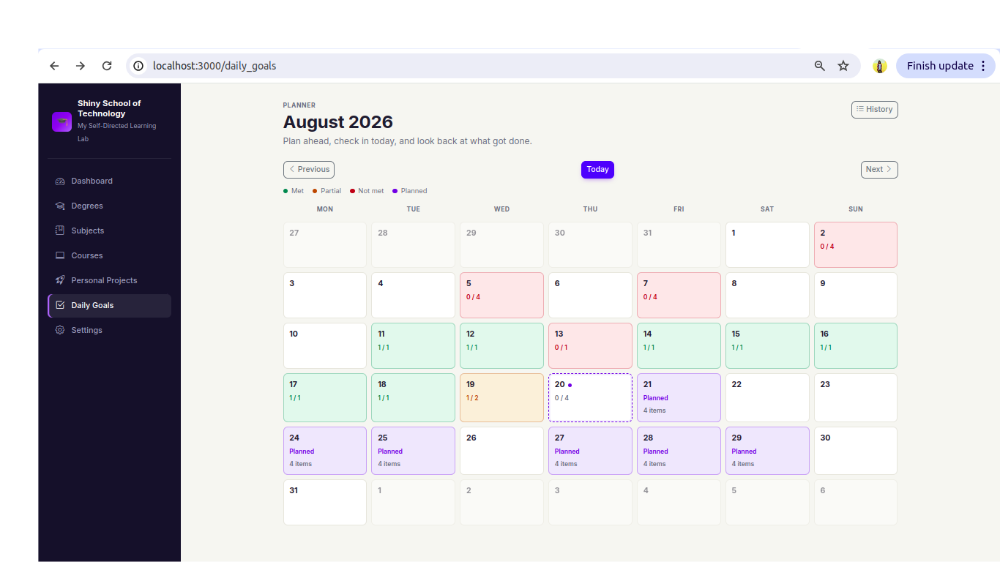
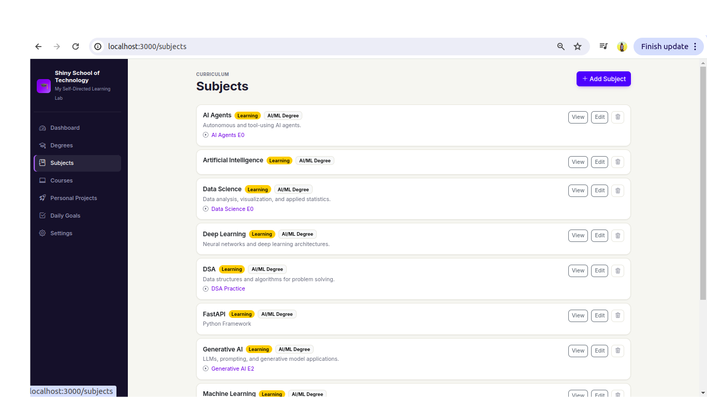

# 🎓 Shiny School of Technology

A personal, self-hosted learning management system for organizing and tracking self-directed learning.

Built with **Ruby on Rails + PostgreSQL** using an **AI-assisted / vibe coding workflow**.

> One university. One student. A surprisingly serious test suite. 😄

---

## 📖 Why I Built This

I am continuously learning across different areas such as:

- Machine Learning
- Generative AI
- Python
- Deep Learning
- Mathematics
- Data Science
- DSA
- AI Agents

Courses are spread across different platforms, while personal projects, learning roadmaps, and daily study goals often live separately.

I wanted one place where I could answer questions like:

- What am I currently learning?
- Which courses have I completed?
- What should I study next for each subject?
- What am I planning to study today?
- What did I actually complete?
- Which personal projects am I working on?
- How consistent has my learning been?

Instead of adapting my workflow to another productivity tool, I decided to build something around the way I actually learn.

That became **Shiny School of Technology**.

---

## ✨ Features

### 🎓 Degrees & Subjects

Create personal learning degrees and organize subjects under them.

The relationship is many-to-many:

- One Degree can contain multiple Subjects
- One Subject can belong to multiple Degrees

This makes it possible to reuse subjects such as Python or Mathematics across different learning paths.

---

### 📚 Course Roadmaps

Courses belong to Subjects and can be tracked as:

- Planned
- In Progress
- Completed
- Paused
- Dropped

Courses can include:

- Provider
- Level
- Purpose
- Progress percentage
- Roadmap position

Each Subject page acts as a learning roadmap:

**Completed → Current → Next Up**

This makes it easy to see where I am and what I intend to study next.

---

### 🚀 Personal Projects

Learning is not limited to courses.

Personal projects can be tracked alongside the curriculum and linked to multiple Subjects.

Projects can include:

- Goal
- Status
- Target date
- Notes
- Related Subjects

This connects formal learning with practical work.

---

## 📅 Calendar-Based Study Planner

Daily Goals are organized through a monthly calendar.

Any date can be opened:

- Past dates
- Today
- Future dates

This allows the same system to work as both a **study planner** and a **learning history**.

Future dates can be planned independently without affecting current progress statistics.

Calendar states distinguish between:

- Met
- Partial
- Not Met
- Pending
- Planned
- No record

DailyGoal records are created only when needed instead of pre-generating records for every calendar date.

---

## ✅ Smart Daily Checklists

A day's checklist can be built from three different layers.

### 1. Daily Defaults

Goals that should appear every day.

Example:

```text
Study at least one learning topic
Practice Python
```

---

### 2. Weekday Defaults

Goals can also repeat only on particular weekdays.

For example:

```text
Monday
- Practice DSA
- Review Machine Learning notes

Saturday
- Work on personal project
```

A recurring item can also apply to multiple weekdays:

```text
Monday / Wednesday / Friday
- Mathematics practice
```

---

### 3. Date-Specific Goals

Additional goals can be added to one particular calendar date.

For example:

```text
Monday, August 24

Daily defaults:
- Study one topic
- Practice Python

Monday defaults:
- DSA practice
- Review ML notes

Specific to August 24:
- Finish Machine Learning Week 3
```

Together, these form the final checklist for that date.

---

## 📸 Snapshot-Based Planning

Recurring defaults behave as **templates**, not live references.

When a Daily Goal is created, the applicable recurring items are copied into that day's checklist.

After that, the checklist becomes an independent snapshot.

For example:

If I change my recurring Monday routine next month, Mondays that I have already planned do **not** change.

A future Monday that has not yet been created will use the latest recurrence configuration when it is eventually planned.

This keeps historical and already-planned data reliable.

---

## 📈 Progress Tracking

The application tracks learning consistency through:

- Daily checklist completion
- Monthly completion percentage
- Current streak
- Completed checklist items
- Active courses
- Course progress
- Historical Daily Goals

Future planned dates are excluded from completion and streak calculations until their date arrives.

---

## 🖥️ Screenshots

### Dashboard

The dashboard provides a quick view of today's checklist, learning streak, monthly completion, active courses, degrees, and personal projects.




### Study Calendar

The calendar provides a visual history of completed study days and allows future study plans to be created by clicking a date.



### Subject Roadmap

Each Subject provides a learning path containing completed courses, current studies, and courses planned for the future.



---

# 🤖 Built with an AI-Assisted Development Workflow

This project is also an experiment in **AI-assisted software development**.

A large portion of the implementation was generated through an AI coding workflow using **Cursor and Claude**.

Instead of manually writing every model, controller, route, view, and test, I spent much more of the development process working on:

- Defining requirements
- Deciding application behaviour
- Identifying edge cases
- Reviewing generated implementations
- Testing the application
- Iterating based on actual usage

The project started with a very small idea:

> I want a personal website to track my self-learning.

Then it evolved through actual use:

```text
Degrees & Subjects
        ↓
Course Tracking
        ↓
Personal Projects
        ↓
Course Roadmaps
        ↓
Point-wise Daily Goals
        ↓
Visual Redesign
        ↓
Calendar Planning
        ↓
Recurring Daily / Weekday Goals
        ↓
Date-Specific Study Planning
```

One of the most interesting parts of the experiment has been seeing **which work AI accelerates and which decisions still require careful thinking**.

For example:

- Should changing a recurring Monday goal modify Mondays that were already planned?
- Should future study plans reduce the current month's completion percentage?
- Should an unplanned historical date mean the same thing as a failed study day?
- When should a recurring template become permanent historical data?

The coding agent can implement these decisions very quickly.

But the expected behaviour still needs to be defined.

For this project, that became a large part of the development process.

---

## 🧪 Testing

Despite being a personal application, the project maintains an automated Rails test suite.

The tests cover areas including:

- Model validations
- Associations
- Controller behaviour
- Course roadmap ordering
- Daily checklists
- Recurrence rules
- Calendar behaviour
- Future planning
- Snapshot semantics
- Statistics
- Streak calculation

Current status:

```text
208 test runs
507 assertions
0 failures
0 errors
```

Possibly excessive for a university with exactly one student. 😄

---

## 🛠️ Tech Stack

### Backend

- Ruby 3.2.2
- Ruby on Rails `~> 8.0.5` (currently 8.0.5.1)
- PostgreSQL (via the `pg` gem)

### Frontend

- ERB
- Bootstrap 5 (loaded via CDN — not a gem or bundled npm package)
- Hotwire / Turbo / Stimulus
- Custom CSS design system

### Quality

- Minitest
- RuboCop

### Development Workflow

- Cursor
- Claude
- Git
- GitHub

The application intentionally remains a conventional Rails monolith.

There is currently no React/Vue frontend or separate API.

---

## 🏗️ Domain Model

At a high level:

```text
Degree
   ↕
Subject
   ↓
Course


Subject
   ↕
PersonalProject


DefaultGoalItem
        ↓
    DailyGoal
        ↓
  DailyGoalItem
```

---

## 👤 Single-User by Design

The application currently has **no user-management system**.

That is intentional.

Shiny School of Technology was built primarily as a **single-user, self-hosted personal learning system**, rather than as a multi-tenant SaaS product.

Anyone can clone the project and run their own instance.

Multi-user support may be explored later, but it is not necessary for the current purpose of the application.

---

## 🚀 Running Locally

### Requirements

You will need:

- Ruby 3.2.2 (see `.ruby-version`)
- Bundler
- PostgreSQL

Clone the repository:

```bash
git clone git@github.com:MShiny/shiny-school-of-technology.git
cd shiny-school-of-technology
```

Install dependencies:

```bash
bundle install
```

Set up the database:

```bash
bin/rails db:create
bin/rails db:migrate
bin/rails db:seed
```

Start the Rails server:

```bash
bin/rails server
```

Then visit:

```text
http://localhost:3000
```

> PostgreSQL authentication/configuration may need to be adjusted depending on your local environment.

---

## 🧪 Running Tests

Run the full test suite:

```bash
bin/rails test
```

Run RuboCop:

```bash
bin/rubocop
```

---

## 💡 Development Philosophy

The application deliberately solves **my own learning workflow first**.

It is not intended to compete with commercial LMS or productivity platforms.

The development loop is intentionally simple:

```text
Use it
  ↓
Find friction
  ↓
Define the expected behaviour
  ↓
Let the coding agent implement it
  ↓
Review and test
  ↓
Use it again
```

Instead of creating a large speculative roadmap, features are primarily added when actual usage creates a reason for them.

---

## 🔮 Possible Future Ideas

Future improvements may include:

- Richer learning analytics
- Course notes and learning resources
- Degree completion metrics
- Project milestones
- Better study-history visualization
- Learning reports
- Optional multi-user support

But for now, the main goal is much simpler:

> **Keep learning and let the application evolve with the workflow.**

---

## 📄 License

No license has been selected yet.

---

## 👩‍💻 Author

Built by **MShiny** as a personal learning system and an experiment in AI-assisted software development.